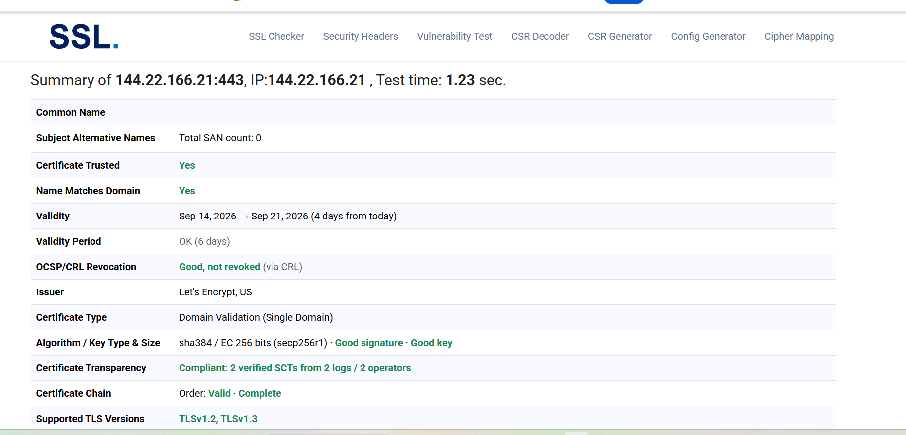
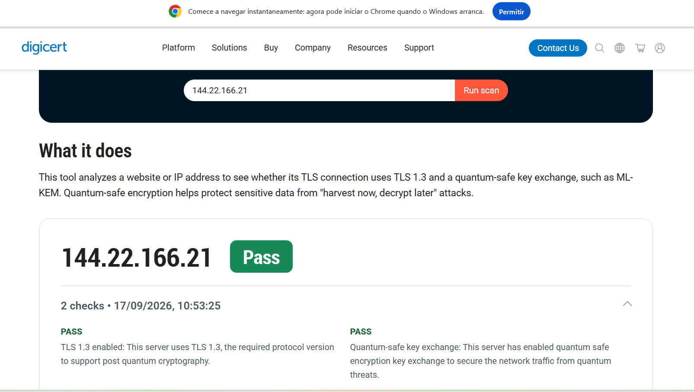
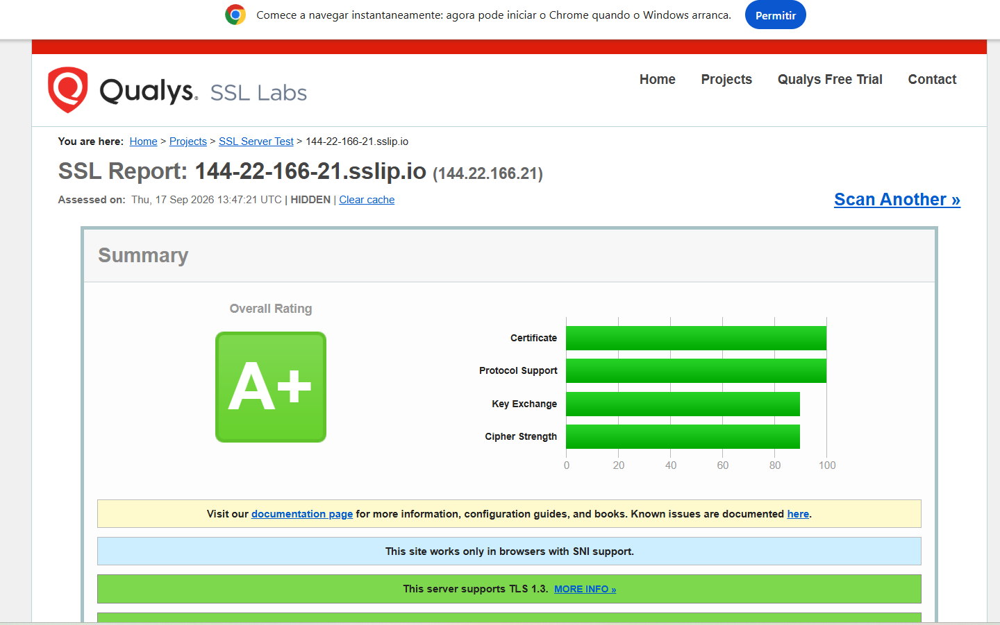

# Protótipo Web Seguro · Projeto Aplicado (Práticas de Mercado)

Aplicação web mínima levada da escrita do código até a produção em nuvem, tratando
**segurança como parte da arquitetura** (Secure by Design) e mantendo **a configuração
padrão já endurecida** (Secure by Default). A entrega cobre os três eixos da disciplina
— desenvolvimento, versionamento e infraestrutura — costurados por uma automação de
implantação.

**Onde ver funcionando**

| | Endereço |
|---|---|
| 🌐 Aplicação (IP) | https://144.22.166.21/ |
| 🔗 Aplicação (hostname de teste) | https://144-22-166-21.sslip.io/ |
| 💾 Código-fonte | https://github.com/pedrohenriquellc/TCC- |

`Python 3` · `Flask` · `Gunicorn` · `Nginx` · `Ubuntu Server 26.04` · `Oracle Cloud (Free Tier)`

Acesso de demonstração: `admin` / a senha fica em `DEMO_PASSWORD` (no arquivo `.env`
do servidor, que nunca é versionado).

> **Fluxo de trabalho com IA.** A construção do protótipo — escrita, refatoração e
> revisão de segurança do código, além da configuração do servidor — foi conduzida em
> par com um assistente de IA, no modelo de desenvolvimento assistido proposto pela
> disciplina (IDE Antigravity). O objetivo foi exercitar a interação com o assistente
> para gerar e depurar código seguro.

---

## 🧩 Eixo 3 — A aplicação e o OWASP Top 10:2025

Um app Flask enxuto, **sem banco de dados** (dispensado pela atividade): um usuário é
definido por variáveis de ambiente e a senha é guardada como hash. São quatro rotas:

- `GET/POST /login` — formulário de autenticação (com token CSRF);
- `GET /dashboard` — **página interna, servida apenas com sessão válida**;
- `POST /logout` — encerra a sessão (via POST + CSRF, para não permitir logout forçado);
- `GET /healthz` — sonda de disponibilidade usada pela pipeline.

A escolha por Flask foi proposital: os controles exigidos (sessão, CSRF, cabeçalhos de
segurança, hash forte, limitação de tentativas) vêm de bibliotecas maduras e com pouca
superfície de ataque, o que torna cada mitigação simples de implementar **e de comprovar**.

### As três categorias mitigadas

O código neutraliza, de forma ativa, três frentes do
[OWASP Top 10:2025](https://owasp.org/Top10/2025/):

**🔒 A01 — Broken Access Control**
`app.py`, decorator `login_required` sobre a rota `/dashboard`. O conteúdo interno só é
entregue quando há `session["user"]`; qualquer tentativa direta sem sessão cai em
redirecionamento para `/login`. O logout, sendo POST com token CSRF, impede que
terceiros forcem a saída de um usuário.

**💉 A05 — Injection (incl. XSS)**
Entrada do campo usuário validada por allowlist (`^[A-Za-z0-9_.-]{3,32}$`) — o que não
casa é recusado com HTTP 400. A saída dinâmica passa pelo autoescape do Jinja2 (ligado),
anulando XSS refletido, e todo POST exige token CSRF do Flask-WTF.

**🔑 A07 — Authentication Failures**
Senha nunca em claro: só o hash **scrypt** (`werkzeug.security`) é guardado, e a
verificação é resistente a *timing*. O login tem **rate limiting** (Flask-Limiter,
5/min → HTTP 429) contra força bruta, calcula um hash "dummy" para usuários inexistentes
(evita enumeração) e regenera a sessão a cada entrada (anti session-fixation). O cookie
de sessão nasce `HttpOnly`, `Secure` e `SameSite=Lax`.

> **Reforço (A02 — Security Misconfiguration):** CSP, `X-Frame-Options`,
> `X-Content-Type-Options` e HSTS enviados por padrão; `DEBUG` desligado; `SECRET_KEY`
> obtido do ambiente, nunca no código.

### Comportamento observado nos testes

| Requisição | Esperado | Resultado |
|---|---|---|
| Login correto | redireciona para `/dashboard` (302) | 302 ✔ |
| `/dashboard` sem sessão | redireciona para `/login` (302) | 302 ✔ |
| Logout | volta a `/login` (302) | 302 ✔ |
| `/dashboard` após logout | bloqueado, vai a `/login` (302) | 302 ✔ |
| POST de login sem CSRF | recusado (400) | 400 ✔ |
| Usuário fora da allowlist | recusado (400) | 400 ✔ |
| Mais de 5 logins/min | limitado (429) | 429 ✔ |
| `/healthz` | `{"status":"ok"}` (200) | 200 ✔ |

**Rodar na sua máquina:**
```bash
python3 -m venv .venv && source .venv/bin/activate
pip install -r requirements.txt
cp .env.example .env            # preencha SECRET_KEY, DEMO_USER, DEMO_PASSWORD
FLASK_INSECURE=1 python app.py  # http://127.0.0.1:8000
```

---

## ☁️ Eixo 1 — Infraestrutura, TLS e pós-quântica

Servidor provisionado na **Oracle Cloud (Free Tier)**, shape Always Free
`VM.Standard.E2.1.Micro`, rodando **Ubuntu Server 26.04 LTS** (OpenSSL 3.5.5). O
**Nginx** faz a terminação TLS e repassa as requisições ao Gunicorn em
`127.0.0.1:8000`. O passo a passo completo está em
[`docs/GUIA-INFRAESTRUTURA.md`](docs/GUIA-INFRAESTRUTURA.md).

### O que foi endurecido — e como conferir

| Controle | O que foi feito | Comando de verificação |
|---|---|---|
| Login remoto | Só chave SSH (ed25519); senha desativada | `sudo sshd -T \| grep passwordauth` |
| Anti-brute-force SSH | Fail2Ban na porta 22 — 4 falhas, banimento de 24 h | `sudo fail2ban-client status sshd` |
| Portas expostas | Apenas 22/80/443 (Security List da OCI + iptables/UFW) | `sudo iptables -S INPUT` |
| Certificado | Certbot 5.8, cert de IP da Let's Encrypt (short-lived) + renovação automática | `sudo certbot certificates` |
| Força para HTTPS | Nginx devolve 301 de 80 → 443 | `curl -I http://144.22.166.21` |
| Pós-quântica | `ssl_ecdh_curve X25519MLKEM768:...` (ML-KEM, OpenSSL 3.5) | `openssl s_client -connect 144.22.166.21:443 -groups X25519MLKEM768 -tls1_3` |

As configurações reais estão versionadas em [`deploy/`](deploy/)
(`nginx-projeto-seguro.conf`, `tls-pqc.conf`, `projeto-seguro.service`,
`fail2ban-jail.local`).

### Provas de conformidade TLS/SSL e PQC

A aplicação é acessada por **IP**, então a checagem oficial usa as ferramentas indicadas
para esse caso (SSL.org e DigiCert). Para também rodar o Qualys SSL Labs — que não aceita
IP puro — o mesmo servidor responde por um hostname `sslip.io` que aponta para o próprio
IP (`144-22-166-21.sslip.io`); **não houve registro de domínio**, e a configuração TLS é
a mesma nos dois endereços.

**Pelo IP público `144.22.166.21`:**

- **SSL.org** → *Certificate Trusted: **Yes*** · *Algorithm/Key: **Good signature · Good
  key*** (ECDSA P-256 / SHA-384) · emissor Let's Encrypt · TLS 1.2 e 1.3
  

- **DigiCert PQC Checker** → ***Pass*** — *TLS 1.3 enabled* e *Quantum-safe key exchange*
  (ML-KEM / `X25519MLKEM768`)
  

**Pelo hostname (reforço, Qualys SSL Labs):**

- **Nota geral A+**, com TLS 1.3, HSTS válido e troca de chave pós-quântica
  (`X25519MLKEM768`). Relatório ao vivo:
  [ssllabs.com/ssltest](https://www.ssllabs.com/ssltest/analyze.html?d=144-22-166-21.sslip.io)
  

> Os prints estão em [`docs/evidencias/`](docs/evidencias/). Como o certificado de IP
> tem vida curta e se renova sozinho, basta refazer as capturas perto da apresentação —
> os resultados permanecem.

---

## 📦 Eixo 2 — Versionamento sem vazamentos

- Repositório **público** no GitHub; conta com **2FA** e operações autenticadas por
  chave SSH (ou PAT).
- O [`.gitignore`](.gitignore) barra `.env`, chaves privadas (`*.pem`, `id_*`),
  credenciais de nuvem (`.oci/`, `.aws/`), senhas e bancos locais.
- Nada de segredo real no histórico: valores sensíveis vivem no `.env` local (fora do
  Git) e nos **GitHub Secrets** usados pela pipeline.

---

## 🔄 Entrega contínua (GitHub Actions)

Todo `git push origin main` aciona
[`.github/workflows/deploy.yml`](.github/workflows/deploy.yml), em três etapas:

1. **Verificação** — instala dependências, importa a aplicação e roda `pip-audit`
   (auditoria de dependências, tocando em **A03 — Software Supply Chain**).
2. **Publicação** — via SSH (chaves em Secrets), atualiza o código na VM
   (`git reset --hard origin/main`), reinstala dependências e reinicia o serviço.
3. **Sonda** — confirma `https://144.22.166.21/healthz` após o deploy.

Os segredos `SSH_HOST`, `SSH_USER`, `SSH_PORT` e `SSH_PRIVATE_KEY` ficam nos GitHub
Secrets; o arquivo `.yml` não contém nenhuma credencial.

---

## ✅ Conferência final da entrega

- [x] App no ar por IP público, servido pelo Nginx
- [x] HTTPS (Certbot/Let's Encrypt) com redirecionamento automático de 80 → 443
- [x] Conformidade TLS/PQC comprovada (SSL.org, DigiCert e SSL Labs A+)
- [x] SSH só por chave + Fail2Ban (4 tentativas / 24 h) na porta 22
- [x] Repositório público, conta protegida, sem segredos versionados
- [x] Login, página interna e logout — com apoio de IA no desenvolvimento
- [x] Três categorias do OWASP Top 10:2025 tratadas (A01, A05, A07)
- [x] Implantação automatizada por GitHub Actions
